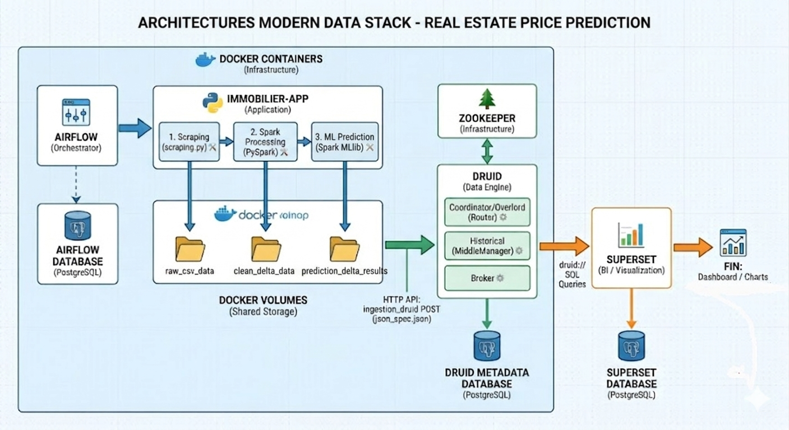

# 🏡 Real Estate Prices ETL

Un projet Data Engineering complet qui couvre toutes les étapes d’un pipeline moderne de traitement de données, depuis le **web scraping** jusqu’à la **visualisation interactive des prédictions de prix immobiliers**.

Ce projet a pour double objectif :
- 🚀 **Monter en compétences** sur les outils les plus utilisés en ingénierie des données.
- 🏗️ **Construire une stack de production** réaliste et maintenable.

---

## 🌐 Vue d’ensemble du projet

L’objectif est de construire un **système automatisé, orchestré et conteneurisé** qui gère le cycle de vie complet de la donnée immobilière.

- 🕸 **Scrape** : Extraction automatisée des prix et caractéristiques (BeautifulSoup).
- ⚙️ **ETL & Data Lake** : Nettoyage, structuration et stockage ACID avec **PySpark** dans des **Delta Tables**.
- 🧠 **Machine Learning** : Entraînement d'un modèle de classification et de clustering via **Spark MLlib**.
- 🗃️ **Injest Analytics** : Chargement des prédictions dans **Apache Druid** pour des requêtes analytiques ultra-rapides.
- 📊 **Visualise** : Dashboard interactif sur **Apache Superset** pour explorer les résultats.
- 🪄 **Orchestrate** : Planification et supervision de toutes les tâches avec **Apache Airflow**.

---

## 🗺️ Architecture du Pipeline

L'ensemble de l'infrastructure est déployé de manière isolée via **Docker Compose**. Le diagramme ci-dessous illustre le flux de données et l'interaction entre les différents services conteneurisés.

**Flux de données détaillé (basé sur le diagramme) :**

1.  **Application (IMMOBILIER-APP) :** Le cœur fonctionnel.
    * `scraping.py` extrait les données.
    * `PySpark` effectue le Spark Processing.
    * `Spark MLlib` exécute le clustering et la classification.
2.  **Shared Storage (Docker Volumes) :** La persistance des données. Les scripts lisent et écrivent dans des **Delta Tables** (Data Lake) partagées entre les conteneurs (`raw_delta_data`, `clean_delta_data`).
3.  **Data Ingestion (HTTP API) :** Une fois le modèle entraîné, les prédictions sont envoyées à **Apache Druid** via une requête `POST` sur son API d'ingestion.
4.  **Analytics & Visualization :**
    * **Druid** (Coordonnateur, Historique, Courtier) indexe les données.
    * **Superset** se connecte à Druid via des requêtes SQL pour alimenter le Dashboard final.

---

## 💡 Technologies utilisées

| 🧩 Catégorie        | 🔧 Technologie             | 📘 Description |
|--------------------|----------------------------|----------------|
| **Web Scraping**   | Python                     | Langage principal du projet |
|                    | BeautifulSoup & Requests   | Extraction HTML rapide et simple |
| **ETL / Traitement** | Apache PySpark             | Traitement distribué de données massives |
| **Stockage brut & Data Lake** | Delta Lake           | Couches ACID sur fichiers parquet |
| **Machine Learning** | PySpark MLlib              | ML intégré à Spark pour la scalabilité |
| **Data Warehouse** | Apache Druid               | Base analytique OLAP rapide & temps réel |
| **Orchestration**  | Apache Airflow             | Orchestration des tâches ETL/ML |
| **Conteneurisation** | Docker & Docker Compose    | Déploiement local multi-service |
| **Visualisation**  | Apache Superset            | Dashboards interactifs open-source |